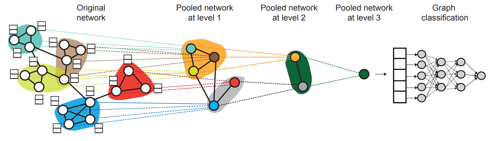

# Hierarchical Graph Representation Learning with Differentiable Pooling



Diffpool implementation for the Graph Deep Learning for Medical Applications seminar in the summer semester of 2022 at 
the Technical University of Munich.

Links to the original paper:
* ArXiv: https://arxiv.org/abs/1806.08804
* Code Repository: https://github.com/RexYing/diffpool

Official Pytorch Geometric (PyG) example: https://github.com/pyg-team/pytorch_geometric/blob/master/examples/proteins_diff_pool.py

Official Deep Graph Library (DGL) example: https://github.com/dmlc/dgl/tree/master/examples/pytorch/diffpool

# Dependencies

* PyTorch 1.11+
* PyTorch-Geometric 2.0+
* Deep Graph Library 0.8+

# Installation

Make sure you have [Python 3.9](https://www.python.org/downloads/release/python-3912/) and 
[Poetry](https://python-poetry.org/docs/#installation) installed on your system. The code is only tested on Linux (Fedora) 
and Windows 11.

To install all dependencies, run:

```shell
poetry install
```